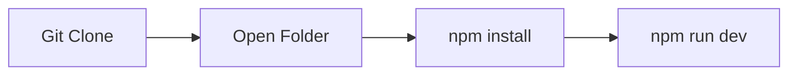

[](https://awesome.re)


<p align="center">
  <a href="avlinktree.vercel.app">
    
  </a>

</p>
<h1 align="center" >My Own LinkTree </h1>

  
</p>

A sleek and modern Linktree-style web app built with Next.js, TypeScript, Tailwind CSS, and Framer Motion for smooth animations. Designed for quick and efficient access to your social media links or personal projects, with dynamic caching for enhanced performance.

## Features:
- **Next.js** for fast, server-side rendering.
- **TypeScript** for type-safe development.
- **Tailwind CSS** for highly customizable and responsive styling.
- **Framer Motion** for fluid animations and interactions.
- **Dynamic caching** to optimize load times and user experience.

## Project Highlights:
> [!CAUTION]
> Developed in under **3 hours** during a caffeine-powered coding sprint ⚡☕.
- Still to be integrated: **analytics** for tracking and optimizing user engagement.

<br>

## Demo Screenshot of Home Page


## Setting Up My-Own-LinkTree

1. Installing Dependencies:
    ```bash
       npm install

2. Starting the Server:
    ```bash
      npm run dev
<br>

<p>Running website on Local Host</p>



 ## 💻 Current Tech Stack
<div style="display: inline_block"><br>
  
  
  
  
  
</div>

<div><h2><strong>Developer of this project 🔻</strong></h2></div>

<table align="center">
<tr align="center">
<td>

**ADITYA VERMA**

<p align="center">

</p>
<p align="center">
<a href = "https://github.com/ADITYAVOFFICIAL"></a>
<a href = "https://www.linkedin.com/in/aditya-verma-real/">

</a>
<a href = "https://medium.com/@adityaver">

</a>
</p>
</td>
</table>

 ## Current Contributors 🔻
<div align="center">
  <a href="https://github.com/ADITYAVOFFICIAL/My-Own-LinkTree/graphs/contributors">
  
</a>
</div>

